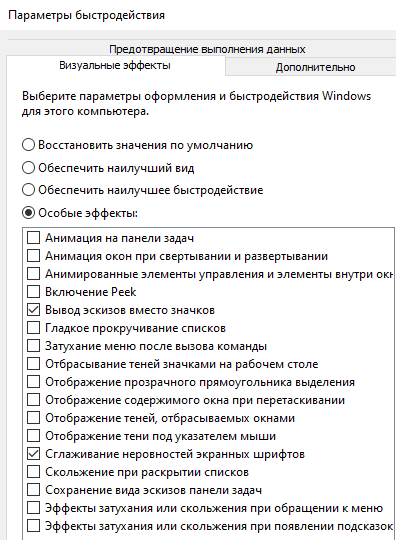
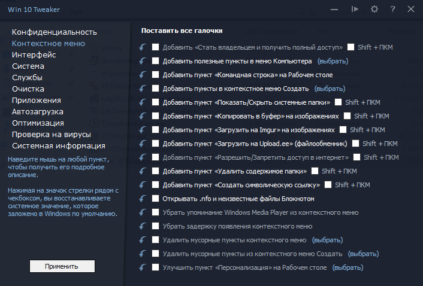
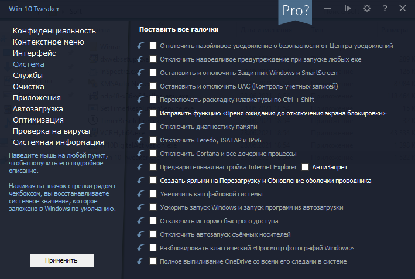
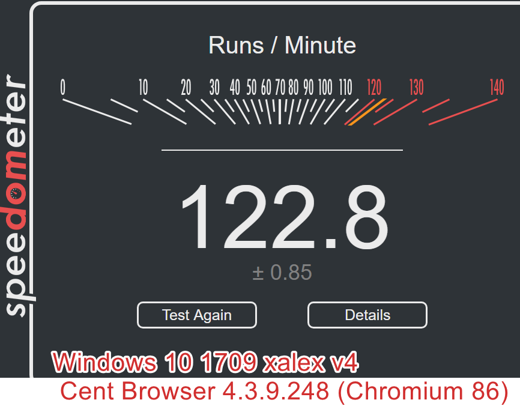
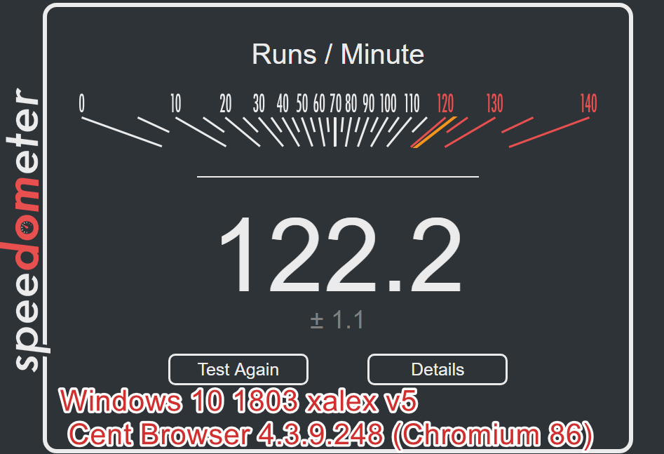
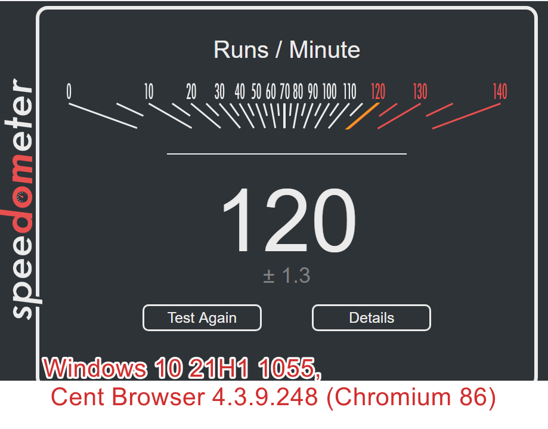

# Исследование производительности семейства Windows

## Испытуемые

1. Windows 10 Pro x64 1709, Xalex v4, сборка 16299.125
2. Windows 10 Pro x64 1803, Xalex v5, сборка 17134.137
3. Windows 10 Pro x64 21H1, оригинал, сборка 19043.1052 **с установкой обновления до 19043.1055**

## Условия тестирования

### Конфигурация компьютера

* i7 8700K 4.8 GHz (разгон)
* RAM 3600 CL 16 (XMP) Dual Rank
* M2 Samsung 970 Pro (MLC), виртуальные машины располагались на нём

### Конфигурация виртуальных машин

Версия VirtualBox: `5.2.34` (+ Extensions)
Испытания проводились в одинаковых виртуальных машинах, при следующей конфигурации:

* RAM: 4096
* CPU ядра: 4
* 2D и 3D ускорение отключено
* Intel виртуализация включена
* Для носителя системы стоит галочка "твердотельный накопитель"

Все устанавливаемые системы прошли **следующий путь установки и настройки**:

1. При установке предварительно:
   * был выключен интернет
   * создана локальная учетная запись
   * выключены все переключатели конфиденциальности
2. Для сборок **Xalex** выбиралась редакция **Pro без Edge и без Store** (Lite версия).
3. Отключена индексация содержимого файлов на системном диске C.
4. Для `Windows 10 Pro x64 21H1` обновление до `19043.1055` производилось при помощи DISM:  
   используя [KB5004476 пакет обновлений (прямая ссылка)](http://download.windowsupdate.com/d/msdownload/update/software/updt/2021/06/windows10.0-kb5004476-x64_d921e030a0749cb41551bbfa9b53c35edbb1e763.msu).  
   Инструкция по обновлению использовалась [по рекомендации @dvgm с форума Win10Tweaker](https://win10tweaker.ru/forum/topic/%d1%81%d0%b0%d0%bc%d0%b0%d1%8f-%d0%b1%d1%8b%d1%81%d1%82%d1%80%d0%b0%d1%8f-windows-10?part=9#postid-32771).
5. Установлены: DirectX, .NET Framework 4.8, Visual C++ Redistribute
6. Отключены:  
   * файл гибернации
   * удалённый доступ
   * защита системы (точки восстановления)
   * установка драйверов из центра обновлений
7. Установлены следующие настройки быстродействия (сглаживание текста оставил включённым):  
   
8. Убраны все плитки из меню пуск
9. Установлен режим энергопотребления "Максимальная производительность", отключена заставка, отключено отключение экрана и USB портов, выключены таймеры пробуждения.
10. Локальный пользователь установлен администратором.
11. Установлена английская раскладка по умолчанию.
12. Выполнена активация Windows при помощи KMSAuto Net.
13. Выполнена очистка папки WinSXS при помощи команды:  
   `Dism.exe /Online /Cleanup-Image /StartComponentCleanup /ResetBase`
14. В компонентах системы отключёны (включение включение компонентов):
    * Windows Media Player
    * Печать в PDF Microsoft
    * Средство просмотра XPS
    * Средство записи XPS документов
    * Службы печати документов
    * Клиент рабочих папок
15. Отключены эффекты прозрачности Windows 10.
16. Отключена защита Spectre и Meltdown при помощи [утилиты Inspectre](https://www.grc.com/inspectre.htm).
17. Установлен период системного таймера 0.5 мс при помощи службы Set Timer Resolution (аналог [Intelligent Standby List Cleaner](https://www.wagnardsoft.com/content/intelligent-standby-list-cleaner-v1000-released)).
18. Установлено одинаковое разрешение виртуальных машин: 1024x768.
19. Отключены маленькие кнопки панели задач для сборок Xalex (чтобы окна имели идентичный размер).
20. Никакое сжатие для систем не производилось.
21. Применён Win10Tweaker с настройками ниже, отключены все службы и удалены все приложения под корень.

### Конфигурация настроек Win10Tweaker

  
Конфиденциальность

  
  Применены все пункты.

  
Контекстное меню

  
  

  
Интерфейс

  
  

  
Система

  
  

## Тесты

> Тесты выполнялись последовательно, а не параллельно, чтобы минимизировать шанс сторонних эффектов.

### LatencyMon 7.00

> Утилита для проверки задержек в системе, находит кривые драйвера. Нужна в основном для диагностики real time audio.  

**Тест проводился ровно минуту.**

#### LatencyMon: 1709 Xalex v4

[ИТОГОВЫЙ отчет LatencyMon для 1709 Xalex v4](research/benchmarks/latencymon/1709/README.md).  

  
LatencyMon: 1709 Xalex v4 [ вкладка: Main ]

  
  ![LatencyMon: 1709 Xalex v4 \[ вкладка: Main \]](research/benchmarks/latencymon/1709/Main.png)

  
LatencyMon: 1709 Xalex v4 [ вкладка: Processes ]

  
  ![LatencyMon: 1709 Xalex v4 \[ вкладка: Processes \]](research/benchmarks/latencymon/1709/Processes.png)

  
LatencyMon: 1709 Xalex v4 [ вкладка: Drivers ]

  
  ![LatencyMon: 1709 Xalex v4 \[ вкладка: Drivers \]](research/benchmarks/latencymon/1709/Drivers.png)

  
LatencyMon: 1709 Xalex v4 [ вкладка: CPUs ]

  
  ![LatencyMon: 1709 Xalex v4 \[ вкладка: CPUs \]](research/benchmarks/latencymon/1709/CPUs.png)

#### LatencyMon: 1803 Xalex v5

[ИТОГОВЫЙ отчет LatencyMon для 1803 Xalex v5](research/benchmarks/latencymon/1803/README.md).  

  
LatencyMon: 1803 Xalex v5 [ вкладка: Main ]

  
  ![LatencyMon: 1803 Xalex v5 \[ вкладка: Main \]](research/benchmarks/latencymon/1803/Main.png)

  
LatencyMon: 1803 Xalex v5 [ вкладка: Processes ]

  
  ![LatencyMon: 1803 Xalex v5 \[ вкладка: Processes \]](research/benchmarks/latencymon/1803/Processes.png)

  
LatencyMon: 1803 Xalex v5 [ вкладка: Drivers ]

  
  ![LatencyMon: 1803 Xalex v5 \[ вкладка: Drivers \]](research/benchmarks/latencymon/1803/Drivers.png)

  
LatencyMon: 1803 Xalex v5 [ вкладка: CPUs ]

  
  ![LatencyMon: 1803 Xalex v5 \[ вкладка: CPUs \]](research/benchmarks/latencymon/1803/CPUs.png)

#### LatencyMon: 21H1 (1055)

[ИТОГОВЫЙ отчет LatencyMon для 21H1 (1055)](research/benchmarks/latencymon/21H1/README.md).  

  
LatencyMon: 21H1 (1055) [ вкладка: Main ]

  
  ![LatencyMon: 21H1 (1055) \[ вкладка: Main \]](research/benchmarks/latencymon/21H1/Main.png)

  
LatencyMon: 21H1 (1055) [ вкладка: Processes ]

  
  ![LatencyMon: 21H1 (1055) \[ вкладка: Processes \]](research/benchmarks/latencymon/21H1/Processes.png)

  
LatencyMon: 21H1 (1055) [ вкладка: Drivers ]

  
  ![LatencyMon: 21H1 (1055) \[ вкладка: Drivers \]](research/benchmarks/latencymon/21H1/Drivers.png)

  
LatencyMon: 21H1 (1055) [ вкладка: CPUs ]

  
  ![LatencyMon: 21H1 (1055) \[ вкладка: CPUs \]](research/benchmarks/latencymon/21H1/CPUs.png)

### Cent Browser 4.3.9.248 (86.0)

**Версия**: `4.3.9.248, (64 бит) (Chromium 86.0.4240.198)`

**Показаны результаты второго запуска тестов**, чтобы исключить загрузку JavaScript, вместо этого взять его из кэша браузера.

#### JetStream 2 Benchmark

* [Cent Browser — JetStream 2: 1709 (PDF)](research/benchmarks/centbrowser-4.3.9.248-chromium-86/jetstream2/jetstream2--centbrowser-4.3.9.248-chromium-86-windows-10-1709-xalex-v4.pdf)
* [Cent Browser — JetStream 2: 1803 (PDF)](research/benchmarks/centbrowser-4.3.9.248-chromium-86/jetstream2/jetstream2--centbrowser-4.3.9.248-chromium-86-windows-10-1803-xalex-v5.pdf)
* [Cent Browser — JetStream 2: 21H1 (1055) (PDF)](research/benchmarks/centbrowser-4.3.9.248-chromium-86/jetstream2/jetstream2--centbrowser-4.3.9.248-chromium-86-windows-10-21H1-1055.pdf)

#### Speedometer 2.0

> Показывает реальную производительность JavaScript приложений в браузере на разных framework'ах.

  
Cent Browser — Speedometer 2.0: 1709

  
  

  
Cent Browser — Speedometer 2.0: 1803

  
  

  
Cent Browser — Speedometer 2.0: 21H1 (1055)

  
  

### Chromium 93.0.4558

**Версия**: `93.0.4558.0 (Сборка для разработчиков), (64 бит)`

**Показаны результаты второго запуска тестов**, чтобы исключить загрузку JavaScript, вместо этого взять его из кэша браузера.

### UserBenchMark

> Полезный тест только из-за System Memory Latency Ladder.

1. [Windows 10 Pro x64 1709, Xalex v4, сборка 16299.125](https://www.userbenchmark.com/UserRun/44249123)
2. [Windows 10 Pro x64 1803, Xalex v5, сборка 17134.137](https://www.userbenchmark.com/UserRun/44249239)
3. [Windows 10 Pro x64 21H1, оригинал, сборка 19043.1055](https://www.userbenchmark.com/UserRun/44249324)
